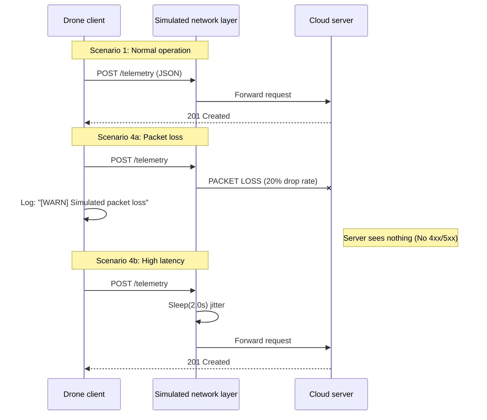

# Drone-to-Cloud telemetry & diagnostics testbed

This is a small sandbox to explore and diagnose drone-to-cloud failure scenarios.

A simulated IoT pipeline where a drone sends flight data to a cloud server to practice network troubleshooting, API integration, and system diagnostics across the network, application, and data layers.


## Project goal
To create a controlled environment for reproducing and diagnosing common drone-to-cloud failure modes, such as packet loss, firewall blocking, and invalid or incomplete telemetry data.

## Architecture
* **Client (`drone_client.py`):** Simulates a drone by reading historical flight logs (`flight_log.csv`) and sending telemetry via HTTP POST. It includes error handling for timeouts and network drops.
* **Server (`cloud_server.py`):** A Flask-based REST API that validates incoming JSON payloads and stores flight history in a SQLite database.
* **Dashboard:** A lightweight web interface for near-real-time visualization of stored telemetry data. 

## Tech stack
* **Language:** Python 3.x
* **Framework:** Flask (Web API)
* **Database:** SQLite (Persistent Logging)
* **Networking:** HTTP/REST (Requests library), TCP/IP troubleshooting
* **Data Format:** JSON & CSV (Simulating Flight Log Replay)

## Project structure

```
drone-to-cloud/
├── cloud_server.py       # Flask backend & SQLite database logic
├── drone_client.py       # Client simulation (reads CSV & sends requests)
├── flight_log.csv        # Sample flight path
├── telemetry_api.json    # Postman collection for manual testing
├── requirements.txt      # Python dependencies
└── README.md             # Documentation
```

## Troubleshooting scenarios

### Scenario 1: The service crash
* Simulation: While the client is running, manually terminate the Flask server process (Ctrl+C in terminal).

* Symptom: Client logs **[Errno 111] Connection refused**.

* Diagnosis: Ping works but the application port is closed.

### Scenario 2: The firewall block
* Simulation: Configure macOS Firewall to "Block incoming connections" for Python.

* Symptom: Client logs **timeout** after 5s hang.

* Diagnosis: The system firewall is dropping packets before they reach the application.

### Scenario 3: Integration failure (bad data)
* Simulation: Modify `drone_client.py` to comment out the latitude field in the JSON payload (this will send incomplete JSON payloads.)

* Symptom: Server responds with **HTTP 400 Bad Request**.

* Diagnosis: Connection is good, but the JSON format is invalid.

### Scenario 4: Network degradation (weak signal)
* Simulation: Modified client script to introduce random latency (0.5s–2s) and 20% packet drop rate.

* Symptom: Dashboard updates become choppy; logs show intermittent gaps but no hard errors.

* Diagnosis: Ping works and the server remains reachable (we can rule out a crash) as logs show sporadic 200 OKs. The issue is network instability (latency and packet loss) rather than the application failing.

* Additional note: This scenario can sometimes be misdiagnosed as an application failure, leading to unnecessary engineering escalations.

## Scenarios diagram


## Future additions

This project currently focuses on **TCP / REST–based telemetry** (reliable command-and-control). Future plans include adding **UDP / WebRTC** for low-latency video streaming to compare how bad networks affect video and data.
* **Glitch vs. Disconnect:** How packet loss causes visual glitches in video (UDP) compared to when telemetry (TCP) just lags or disconnects.
* **Field diagnosis:** Distinguish between a degraded video link and a network failure during UAS operations.

## How to run it

### 1. Setup
Clone the repository and install dependencies:
```bash
pip3 install -r requirements.txt
```

### 2. Start the ground station (the server)
Open a terminal and run:
```bash
python3 cloud_server.py
```

**Network**: Listens on **0.0.0.0:5000** (Accepts external connections).

**Local Dashboard**: Access via **http://127.0.0.1:5000** in your browser.

**Note**: The telemetry.db file is created automatically at runtime (it is not included in the repo).

### 3. Launch the flight simulation (the drone)
Open a new terminal tab and run:
```bash
python3 drone_client.py
```
This script replays a historical flight from `flight_log.csv`. You will see it transmitting coordinates every 2 seconds.

### 4. Monitor operations
**Real-time**: Check the terminal for HTTP status codes.

**Dashboard**: Open your browser and navigate to: http://127.0.0.1:5000 to see the flight data populating the table in real-time.